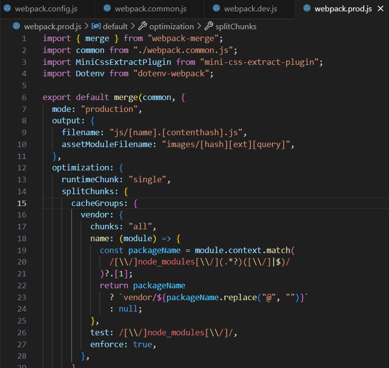

Vamos a comenzar la entrega de bundling inicializando el proyecto con "npm init" para tener un package.json inicial.

Ejecutamos el "npm init".

Ahora instalaremos webpack junto a su cli. Crearemos también el archivo webpack.config.js.

-npm i webpack webpack-cli -D

Instalamos babel y su loader.

-npm install @babel/cli @babel/core @babel/preset-env --save-dev

-npm install babel-loader --dev-save

Ahora creamos el archivo .babelrc y hacemos una configuración básica.

babel:
{
"presets":["@babel/preset-env"]
}

webpack:

Ya tenemos nuestro proyecto con webpack y capaz de transpilarnos JS con babel. Ahora daremos soporte a html con sus respectivos loaders y plugins. 

Vamos a instalar ahora el servidor de desarrollo de webpack y el plugin de HTML.

-npm install --save-dev webpack webpack-dev-server

-npm install --save-dev html-loader

Por ahora nuestro webpack.config.js va así:

Seguimos con CSS:

-npm install style-loader css-loader --save-dev
 
Hemos configurado de manera básica el loader de css y añadido unos estilos simples. Ahora instalaremos MiniCssExtractPlugin que usaremos posteriormente para producción.

-npm install mini-css-extract-plugin

Ya tenemos nuestro proyecto con css compilado y la posibilidad de usar style-loader y MiniCss .

Instalamos scss y su loader y coonfiguramos webpack.config.js para reconocer y transpilar los archivos  scss a css.

-npm install sass sass-loader --save-dev

Ahora añadiremos react y su preset para babel.

-npm install react react-dom --save

-npm install @babel/preset-react --save-dev

Hemos creado un componente que renderiza nuestro "Hola mundo" y también estamos renderizando el logo de Lemoncode en el index.jsx, junto al componente. 

Vamos a añadir TS al proyecto y adaptarlo para que funcione corretamente.

-npm install @babel/preset-typescript --save-dev.

-npm install typescript --save-dev

Ahora instalaremos npm-run-all para poder ejecutar scripts combinados y ahorrar tiempo, por ejémplo podemos hacer el checkeo de tipos mientras levantamos el servidor.

-npm install npm-run-all --save-dev

Vamos a añadir los source-map como herramienta de desarrollo, no lo utilizaremos en producción.

Instalaremos ahora webpack-merge para poder separar cómodamente nuestra configuración de webpack en varios archivos para cada entorno.

antes de esto nuestro webpack.config.js está de este modo:

Y nuestro package.json:

Tomaremos también la arquitectura de carpetas vista en Lemoncode para organizar el contenido de nuestra carpeta dist; 

webpack.prod.js : 

webpack.dev.js :

